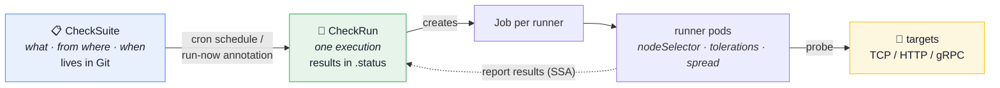
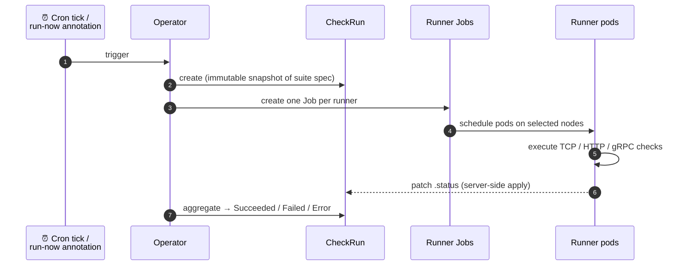

# VeriKube

> Declarative network checks for Kubernetes.

[](https://github.com/frauniki/verikube/actions/workflows/test.yml)
[](https://github.com/frauniki/verikube/actions/workflows/test-e2e.yml)
[](https://github.com/frauniki/verikube/actions/workflows/lint.yml)


VeriKube is an operator that runs network reachability checks (TCP / HTTP /
gRPC) from pods placed on the nodes you choose, and manages the whole lifecycle —
definition, scheduling, execution, results — as Kubernetes resources.



## ✨ Features

- **Declarative & GitOps-friendly** — checks are CRDs; suites live in Git, results live in `.status`
- **Run from where it matters** — place runner pods with `nodeSelector` / `tolerations` / `topologySpread`
- **Three probe types** — TCP connect, HTTP (status / headers), gRPC Health Checking Protocol
- **Negative tests** — assert that a connection **fails** (`expect: Failure`), e.g. to verify security groups
- **Cron scheduling + run-now** — standard 5-field cron, or trigger ad hoc with one annotation
- **Prometheus metrics** — per-suite and per-check result counters, run durations

## Why

Typical questions this answers continuously, instead of via one-off debugging:

- Can pods on nodegroup X reach the database / internal API?
- Does the load-balancer-fronted endpoint answer 200 with the right Host header?
- Do gRPC backends report `SERVING` on the standard health protocol?
- Is the security group actually **blocking** what it should? (negative tests)

## Concepts

| Resource | Role |
|---|---|
| `CheckSuite` | Declares checks, where to run them from (`runners`), and an optional cron `schedule`. Lives in Git. |
| `CheckRun` | One execution. Created by the operator (schedule / manual trigger) or ad hoc. Its spec is an immutable snapshot of the suite; results live in `.status`. |

A **runner** is a set of pods (a Job) placed with `nodeSelector` /
`tolerations` / `topologySpread`, executing the checks assigned to it.
Checks run from every runner by default; restrict one with `checks[].runners`.

### Lifecycle of a run



## Example

```yaml
apiVersion: verikube.dev/v1alpha1
kind: CheckSuite
metadata:
  name: payment-network
  namespace: payment
spec:
  schedule: "*/30 * * * *"     # UTC. Omit for manual-only suites
  concurrencyPolicy: Forbid
  historyLimit: { successful: 3, failed: 5 }
  timeout: 10m
  runners:
    - name: payment-nodes
      replicas: 3
      nodeSelector: { payment-ng: "true" }
      topologySpread:
        topologyKey: topology.kubernetes.io/zone
    - name: batch-nodes
      nodeSelector: { batch-ng: "true" }
  checks:
    - name: db-reachable               # all runners
      tcp: { address: "db.internal:3306", timeout: 5s }
    - name: api-health                 # payment nodes only
      runners: [payment-nodes]
      http:
        url: "https://api.internal/health"
        headers:
          - { name: Host, value: api.example.com }
        expectedStatus: [200]
      retries: { attempts: 3, delay: 5s }
    - name: payments-grpc              # gRPC Health Checking Protocol
      grpc:
        address: "payments.internal:50051"
        service: payments.v1.Payments  # omit to query overall server health
    - name: external-blocked           # negative test: must NOT connect
      tcp: { address: "blocked.example.com:443" }
      expect: Failure
```

Run it now (works even while `suspend: true`):

```bash
kubectl annotate checksuite payment-network verikube.dev/run-now="$(date +%s)" --overwrite
```

Read results:

```bash
$ kubectl get checkrun -n payment
NAME                         SUITE             PHASE       PASSED   FAILED   STARTED   AGE
payment-network-1784112900   payment-network   Succeeded   4        0        2m        2m

# per-pod, per-check detail lives in .status.runners
$ kubectl get checkrun payment-network-1784112900 -o yaml
```

| Phase | Meaning |
|---|---|
| `Succeeded` | All checks ran and passed |
| `Failed` | Checks ran; at least one verdict failed |
| `Error` | The run could not execute (runner Job failed, deadline exceeded, missing ServiceAccount) |

## Install

```bash
helm install verikube ./charts/verikube \
  --namespace verikube-system --create-namespace \
  --set checkNamespaces='{payment,batch}'
```

`checkNamespaces` lists every namespace that will host CheckSuites: the
chart provisions the runner ServiceAccount + RoleBinding there. A suite in
an unlisted namespace fails fast with a `RunnerServiceAccountMissing`
condition telling you exactly what to add.

CRDs are installed as templated resources (so `helm upgrade` rolls schema
changes) and annotated `helm.sh/resource-policy: keep` by default, so
uninstalling the chart never deletes your suites and run history.

### Metrics

Set `metrics.enabled=true` to expose Prometheus metrics
(`verikube_checkruns_total{suite,phase}`,
`verikube_checkrun_duration_seconds{suite}`,
`verikube_check_result_total{suite,check,result}`), and
`metrics.serviceMonitor.enabled=true` if you use prometheus-operator.

## Security model

- **The trust boundary is RBAC on CheckSuite/CheckRun create.** Whoever can
  create a suite can probe arbitrary addresses from arbitrarily placed pods
  (that is the tool's purpose). Grant the CRD roles per namespace,
  deliberately.
- Runner pods run a fixed image and command with no extra privileges, and a
  ServiceAccount limited to `get checkruns` + `patch checkruns/status`.
- Checks targeting loopback / link-local addresses (e.g. cloud metadata,
  `169.254.169.254`) are **refused by default**; opt out with
  `allowLocalTargets: true` in the chart values.
- Residual risk: within a namespace listed in `checkNamespaces`, anything
  with pod-create rights can mount the runner ServiceAccount and patch any
  CheckRun's status there. The controller emits `ForeignResultEntry`
  warning events for result entries whose pod names don't match its Jobs.

## Operational notes

- Schedules are standard 5-field cron, evaluated in **UTC**.
- `startingDeadline` (default 200s) drops stale missed ticks, so
  unsuspending a suite or restarting the operator does not fire catch-up
  runs for windows that already passed.
- Operator upgrades are safe with runs in flight: all state lives in the
  API, and runner Jobs are immutable once created.
- Overriding `runnerImage` in the chart risks version skew: an older runner
  reports check types it doesn't know as explicit failures
  (`unknown check type`) rather than silently skipping them.

## Development

```bash
make test                # unit + envtest (checkers, controllers, SSA contracts)
make test-e2e            # full e2e on a local kind cluster (requires Docker)
make helm-sync-crds      # regenerate chart CRDs after changing api/ types
make docker-build IMG=...
```

`E2E_SKIP_BUILD=true make test-e2e` skips the in-suite image build and uses
a prebuilt `example.com/verikube:v0.0.1` from the local docker daemon —
handy for reusing a CI-built image or on hosts where in-container builds
don't work.

Layout: `api/v1alpha1` (CRDs) · `internal/controller` (CheckSuite/CheckRun
reconcilers) · `internal/checker` (probe plugins: add new check types here)
· `internal/runner` (in-pod execution + server-side-apply reporting) ·
`charts/verikube` (operator chart).

Adding a check type = one checker implementing the `Checker` interface, one
optional field on `CheckSpec`, and one term in its CEL oneof rule.

## License

Apache-2.0
