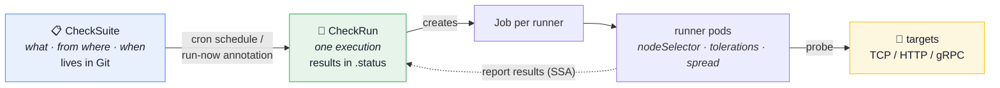
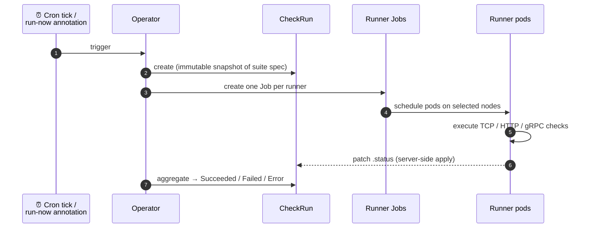

VeriKube manages network checks with two resources and one execution
primitive:

| Resource | Role |
|---|---|
| `CheckSuite` | Declares checks, where to run them from (`runners`), and an optional cron `schedule`. Lives in Git. |
| `CheckRun` | One execution. Created by the operator (schedule or manual trigger) or ad hoc. Its spec is an immutable snapshot of the suite; results live in `.status`. |



## Runners

A **runner** is a set of pods (a Kubernetes Job) placed with
`nodeSelector`, `tolerations` and `topologySpread`, executing the checks
assigned to it. This is the core idea: reachability depends on *where you
probe from*, so you control runner placement exactly like you control
workload placement.

Checks run from **every** runner by default; restrict a check to specific
runners with `checks[].runners`.

## Immutable run snapshots

When the operator creates a CheckRun, it copies the suite's template
(runners, checks, timeout) into the run's spec. Editing the suite never
affects a run that is already in flight — and the run history records
exactly what was checked, with which parameters, at that time.

## Lifecycle of a run



Each runner pod executes its checks and reports its own result set into
the CheckRun's status via server-side apply — each pod owns exactly its
own entry, so reports from well-behaved runners never conflict. (This is
a mechanics guarantee, not an integrity one — see the
[security model](/verikube/security/) for who else can write into the
status.) The operator aggregates everything into a summary and a terminal
phase.

## Phases

| Phase | Meaning |
|---|---|
| `Pending` | Runner Jobs have not been created yet |
| `Running` | Runner Jobs are executing |
| `Succeeded` | All checks ran and passed |
| `Failed` | Checks ran; at least one verdict failed |
| `Error` | The run could not execute (runner Job failed, deadline exceeded, missing ServiceAccount) |

The distinction between `Failed` and `Error` matters: `Failed` means the
checks delivered a verdict and something is unreachable (or reachable when
it shouldn't be); `Error` means there is no verdict because the
infrastructure of the run itself broke. See
[Troubleshooting](/verikube/guides/troubleshooting/) for diagnosing both.

## Reading results

```bash
$ kubectl get checkrun -n payment
NAME                         SUITE             PHASE       PASSED   FAILED   STARTED   AGE
payment-network-1784112900   payment-network   Succeeded   4        0        2m        2m
```

Per-pod, per-check detail — verdict, raw observation, attempts, message,
duration — lives in `.status.runners`:

```bash
kubectl get checkrun payment-network-1784112900 -o yaml
```

The full schema is documented in the
[API reference](/verikube/reference/api/).
