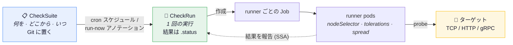
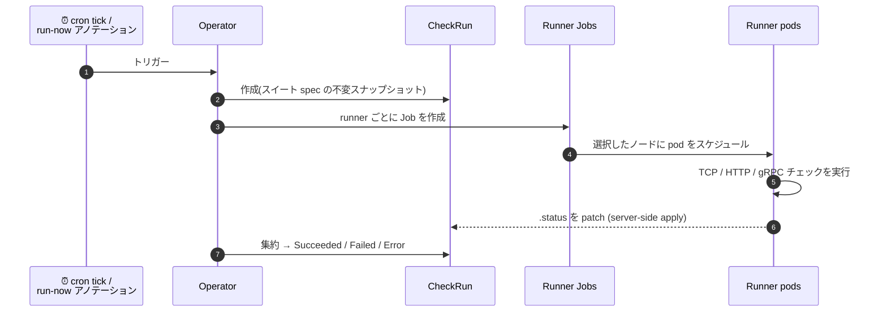

VeriKube は 2 つのリソースと 1 つの実行プリミティブでネットワークチェックを管理します:

| リソース | 役割 |
|---|---|
| `CheckSuite` | チェック内容・実行元(`runners`)・省略可能な cron `schedule` を宣言。Git に置く。|
| `CheckRun` | 1 回の実行。operator(スケジュール / 手動トリガー)またはアドホックに作成。spec はスイートの不変スナップショットで、結果は `.status` に入る。|



## runner

**runner** は `nodeSelector`・`tolerations`・`topologySpread` で配置される pod の集合(Kubernetes Job)で、割り当てられたチェックを実行します。これが核となる考え方です: 到達性は *どこから probe するか* に依存するので、ワークロードの配置を制御するのと同じ方法で runner の配置を制御します。

チェックはデフォルトで**すべての** runner から実行されます。特定の runner に限定するには `checks[].runners` を使います。

## 不変な run スナップショット

operator が CheckRun を作成するとき、スイートのテンプレート(runners、checks、timeout)を run の spec にコピーします。スイートを編集しても実行中の run には影響せず、run の履歴には「そのとき・どのパラメータで・何をチェックしたか」が正確に残ります。

## run のライフサイクル



各 runner pod はチェックを実行し、自分の結果セットを server-side apply で CheckRun の status に報告します — 各 pod は自分のエントリだけを所有するため、正常な runner 同士の報告が衝突することはありません(これは仕組み上の保証であって、完全性の保証ではありません — status に書き込み得る他の主体については[セキュリティモデル](/verikube/ja/security/)を参照)。operator がすべてを集約してサマリと最終 phase を決めます。

## phase

| Phase | 意味 |
|---|---|
| `Pending` | runner Job がまだ作成されていない |
| `Running` | runner Job が実行中 |
| `Succeeded` | すべてのチェックが実行され、すべて pass した |
| `Failed` | チェックは実行されたが、少なくとも 1 つの verdict が fail |
| `Error` | run 自体が実行できなかった(runner Job の失敗、deadline 超過、ServiceAccount 不在) |

`Failed` と `Error` の区別は重要です: `Failed` はチェックが verdict を出した上で何かに到達できない(あるいは到達すべきでないものに到達できた)こと、`Error` は run のインフラ自体が壊れて verdict が存在しないことを意味します。両方の診断は [トラブルシューティング](/verikube/ja/guides/troubleshooting/)を参照してください。

## 結果を読む

```bash
$ kubectl get checkrun -n payment
NAME                         SUITE             PHASE       PASSED   FAILED   STARTED   AGE
payment-network-1784112900   payment-network   Succeeded   4        0        2m        2m
```

pod ごと・check ごとの詳細 — verdict、生の観測結果、試行回数、メッセージ、所要時間 — は `.status.runners` にあります:

```bash
kubectl get checkrun payment-network-1784112900 -o yaml
```

スキーマの全体は [API リファレンス](/verikube/ja/reference/api/)に記載されています。
